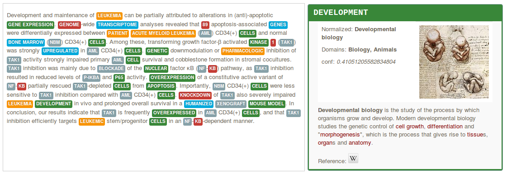

[](http://www.apache.org/licenses/LICENSE-2.0.html)
[](https://readthedocs.org/projects/nerd/?badge=latest)
<!-- [](https://travis-ci.org/kermitt2/nerd) -->
<!-- [](https://coveralls.io/r/kermitt2/nerd) -->
<!-- [](https://hub.docker.com/r/lfoppiano/ grobid/ "Latest Docker HUB image") -->

# (N)ERD

(N)ERD performs the following tasks:

* entity recognition and disambiguation against Wikidata and Wikipedia in a raw text, partially-annotated text segment,


* entity recognition and disambiguation against Wikidata and Wikipedia at document level, for example a PDF with layout positioning and structure-aware annotations,


* search query disambiguation (the _short text_ mode) - bellow disambiguation of the search query "concrete pump sensor" in the service test console,


* weighted term vector disambiguation (a term being a phrase),


* interactive disambiguation in text editing mode.  


Supervised machine learning is used for the disambiguation, based on a Random Forest, exploiting various features. Training is realized exploiting Wikipedia data. Results include in particular Wikidata identifiers and statements 

The API also offers the possibility to apply filters based on Wikipedia properties and values, allowing to create specialised entity identification and extraction (e.g. extract species mentions or all medical entities only in a document) relying on the current 27M entities and 154M statements present in Wikipedia. 

The tool currently supports English, German and French languages (more to come!). For English and French, a Name Entity Recognition based on CRF ([grobid-ner](https://github.com/kermitt2/grobid-ner)) is used in combination with the disambiguation. For each recognized entity in one language, it is possible to complement the result with crosslingual information in the two other languages. A _nbest_ mode is available. Domain information are produced for a large amount of entities in the technical and scientific fields, together with Wikipedia categories and confidence scores. 

The tool is developed in Java and has been designed for fast processing (at least for a NERD system, 500-1000 words per second on an medium-profile linux server single thread or one PDF page of a scientific articles between 1 and 2 seconds), with limited memory (at least for a NERD system, here 2GB of RAM) and to offer close to state-of-the-art accuracy (more to come!). A search query can be disambiguated in 1-5 seconds. (N)ERD uses the very fast [SMILE ML](https://haifengl.github.io/smile/) library for machine learning and a [JNI integration of LMDB](https://github.com/deephacks/lmdbjni) as embedded database. 

(N)ERD requires JDK 1.8 and maven 3. It supports Linux-64 and Mac OS environments. Below, we make available the LMDB binary data for Linux-64 architecture. 

## Install and build 

Running the service requires at least 2GB of RAM, but more RAM will be exploited if available for speeding up access to compiled Wikipedia data (including information extracted from Infoboxes). After decompressing all the index data, 19GB of disk space will be used - be sure to have enough free space. SSD is recommanded for best performance and experience. 

First install _grobid_ and _grobid-ner_, see http://github.com/kermitt2/grobid and http://github.com/kermitt2/grobid-ner

Indicate the path to grobid-home in the file ```src/main/resource/nerd.properties```, for instance: 

```
com.scienceminer.nerd.grobid_home=../grobid/grobid-home/
com.scienceminer.nerd.grobid_properties=../grobid/grobid-home/config/grobid.properties
``` 

Then install the Wikipedia index:

* download the zipped index files (warning: total around 9 GB!) at the following address: 

... currently updated, come soon! ...

<!-- https://grobid.s3.amazonaws.com/nerd/db-kb.zip (1 GB)

https://grobid.s3.amazonaws.com/nerd/db-en1.zip (2.7 GB)

https://grobid.s3.amazonaws.com/nerd/db-en2.zip (2.6 GB)

https://grobid.s3.amazonaws.com/nerd/db-fr.zip (1.6 GB)

https://grobid.s3.amazonaws.com/nerd/db-de.zip (1.8 GB) -->

* unzip the 5 archives files under ```data/wikipedia/```. This will install three sub-directories ```data/wikipedia/db-kb/```, ```data/wikipedia/db-en/```, ```data/wikipedia/db-de/``` and ```data/wikipedia/db-fr/```. Uncompressed data is about 20 GB. 

Build the project, under the NERD projet repository:

```bash
> mvn clean install    
```

Some tests will be executed. Congratulation, you're now ready to run the service. 

## Documentation 

The documentation of the service is available [here](http://nerd.readthedocs.io).

## Run the web service 

```bash
> mvn -Dmaven.test.skip=true jetty:run-war
```

By default the demo/console is available at [http://localhost:8090](http://localhost:8090)
The editor (client is work-in-progress, not stable) can be opened under [http://localhost:8090/editor.html](http://localhost:8090/editor.html)

## Training

Already trained models are provided in this repository. The following section explains how to retrain the models. 

### Training with Wikipedia

Currently a random sample of Wikipedia articles is used for training. The full article content is therefore necessary and a dedicated database will be created the first time the training is launched. This additional database is used and required only for training. You will need the Wikipedia XML dump corresponding to the target languages available in a directory indicated in the `yaml` config files under `data/wikipedia/` by the parameter `dataDirectory` (warning, as this additional database contains the whole textual content of all Wikipedia articles (with wiki markups), it is quite big, around 3.4 GB for the English Wikipedia). 

The following command will build the two models used in (N)ERD, the `ranker` and the `selector` model (both being a Random Forest) and preliminary build the full article content database the first time for the English Wikipedia:

```bash
> mvn compile exec:exec -Ptrain_annotate_en
```

For other languages, replace the ending language code (`en`) by the desired one (`fr` or `de` only supported for the moment), e.g.:


```bash
> mvn compile exec:exec -Ptrain_annotate_de
> mvn compile exec:exec -Ptrain_annotate_fr
```

Models will be saved under `data/models`. `ARFF` training data files used to build the model are saved under `data/wikipedia/training/`.

## Contact

Author and contact: Patrice Lopez (<patrice.lopez@science-miner.com>)
