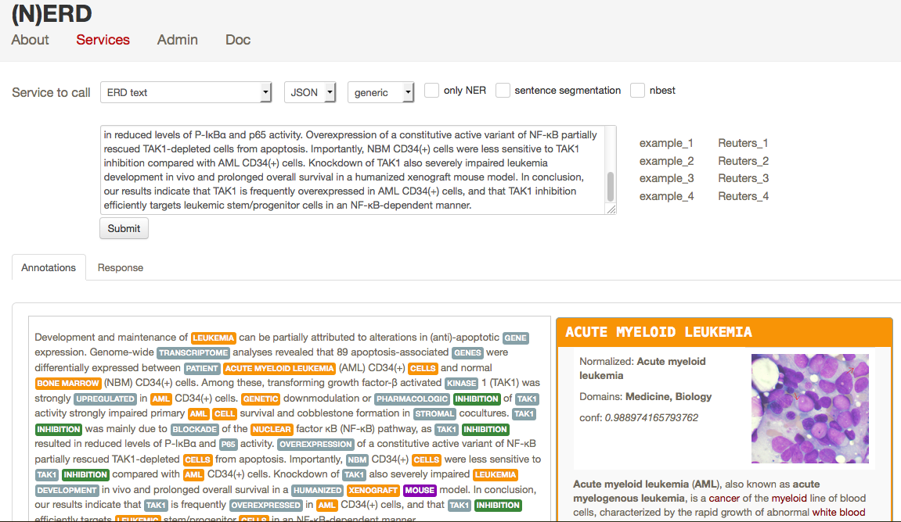

# (N)ERD

(N)ERD performs the following tasks:

* entity recognition and disambiguation against Wikipedia in raw text and partially-annotated text,

* search query disambiguation (the _short text_ mode),

* weighted term vector disambiguation (a term being a phrase),

* interactive disambiguation in text editing mode.  

Supervised machine learning is used for the disambiguation, currently a Bagged Decision Tree, exploiting various features.  

The tool currently supports English, German and French languages. For English, a Name Entity Recognition (grobid-ner, developed by the same author) can be used in combination with the disambiguation. For each recognized entity in one language, it is possible to complement the result with crosslingual information in the two other languages. A _nbest_ mode is available. Domain information are produced for a large amount of entities, together with Wikipedia categories and confidence scores. 

The tool has been designed for fast processing (at least for a NERD, 400-500 words per seconds on a low end linux server), with limited memory (at least for a NERD, 4GB of RAM) and to offer close to state-of-the-art accuracy. 

(N)ERD requires JDK 1.8 and maven 3. It supports Linux-64 and Mac OS environments. Windows has not been tested, but apart the optional NER, (N)ERD should theoretically work. 

## Install and build 

You will need a total of approx. 15GB of free disk space for installing (N)ERD. Running the service requires at least 4GB of RAM. 

First install _grobid_ and _grobid-ner_, see http://github.com/kermitt2/grobid and http://github.com/kermitt2/grobid-ner

Indicate the path to grobid-home in the file ```src/main/resource/nerd.properties```, for instance: 

```
com.scienceminer.nerd.grobid_home=../grobid/grobid-home/
com.scienceminer.nerd.grobid_properties=../grobid/grobid-home/config/grobid.properties
``` 

Then install the wikipedia index:

* download the zipped index files (warning: around 6GB!) at the following address: 

* unzip the archive file under ```data/wikipedia/```. This will install three sub-directories ```data/wikipedia/db-en/```, ```data/wikipedia/db-de/```, ```data/wikipedia/db-fr/``` and one file ```domains-en.db```. 

Build the project, under the NERD projet repository:

```bash
> mvn clean install    
```

Some tests will be executed. Congratulation, you're now ready to run the service. 

## Run the web service 



```bash
> mvn -Dmaven.test.skip=true jetty:run-war
```

By default the demo/console is available at http://localhost:8090

The documentation of the service is available in the following document ```doc/nerd-service-manual.pdf```.
