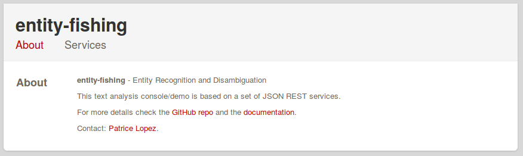
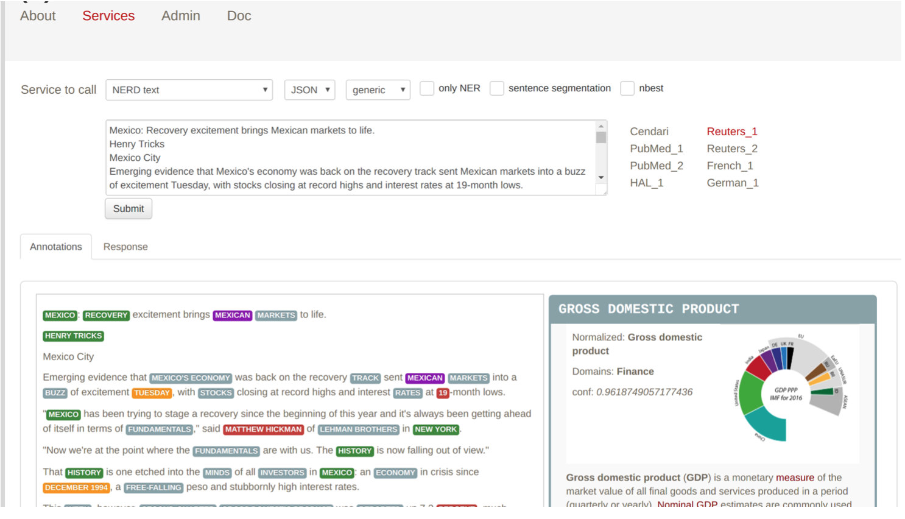
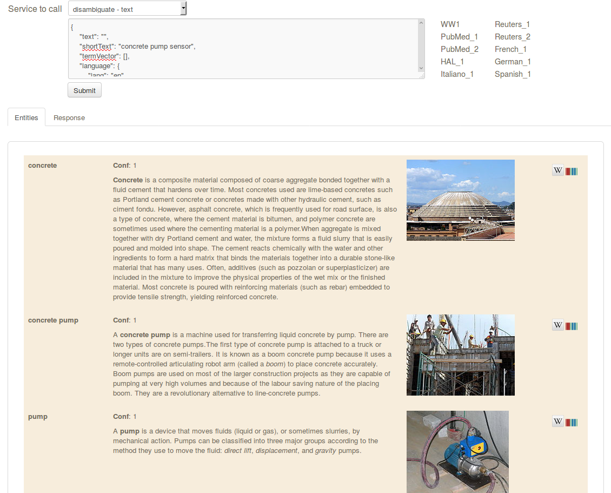
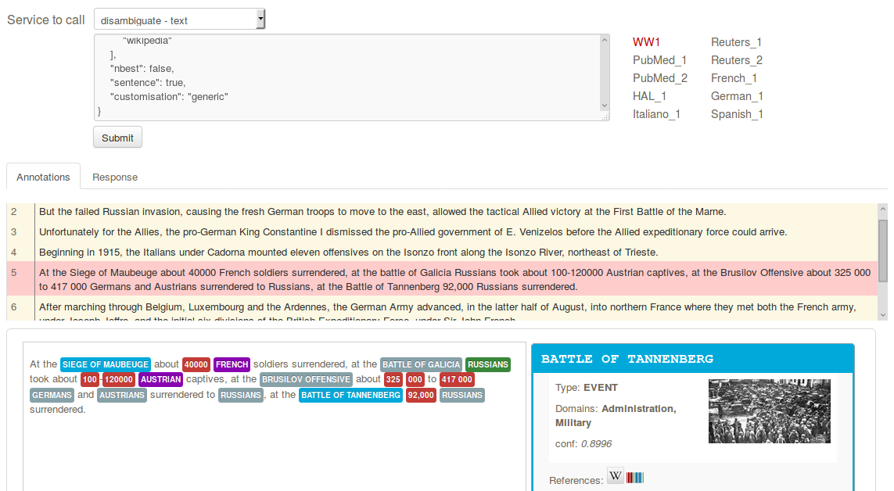
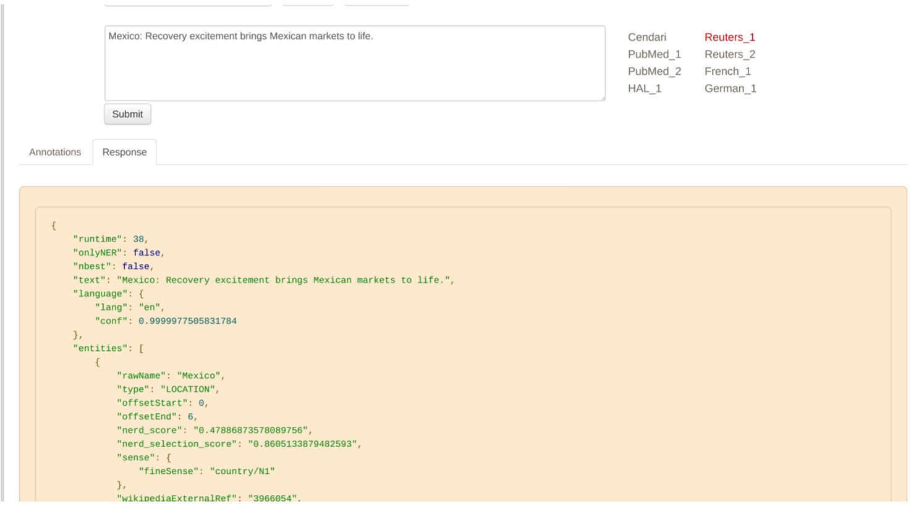

.. topic:: Description of the entity-fishing console.

*entity-fishing* Console
========================

The *entity-fishing* console is a **graphical web interface**, part of the *entity-fishing* project, providing means to discover and test the service. With the console, it is possible to process chunks of text (typically a paragraph), PDF files and to verify which entities are recognised and how they are disambiguated.

The console is also a **reference implementation** in javascript (with JQuery) of a web application using the *entity-fishing* API service. As such, it illustrates how to call the services with mainstream Ajax queries, how to parse JSON results with *vulgus JQuery* and how to dynamically annotate a PDF with PDF.js and a dynamic HTML layer.

The console is available at the root address of the server (e.g. for Tomcat at ``http://<server instance name>/<root context name>``, or ``http://localhost:8090`` for jetty deployed instance).

The About page provides licence (Open Source Apache 2 licence for the entire tool including used dependencies) and contact information.

The web page *Services* allows to test the different REST requests.

A free text form allows the analysis of any text. On the right side of the input form, samples of text can be found, from scientific articles, news and historical documents.

In the lower part, entities are recognised in the provided text and displayed using different colors, based on the entity type and domain. On the lower right side, an infobox is displaying information provided by the service about the disambiguated Wikidata/Wikipedia entity.

In this example the text box is used to disambiguate a search query:

The console allows to test all the different services provided by *entity-fishing*, e.g. it’s possible to visualise the various sentences identified by the the sentence segmentation service (more details on this specific service in the REST API documentation).

In addition, it is possible to view the service raw response (in JSON format) for helping the integration phase:

More details about the response in the next section.

