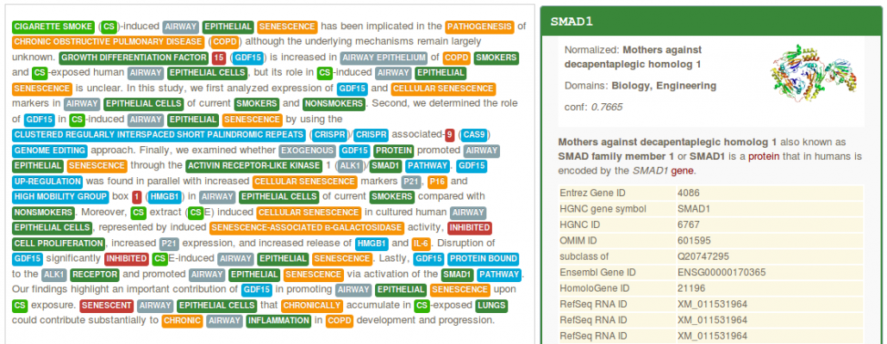
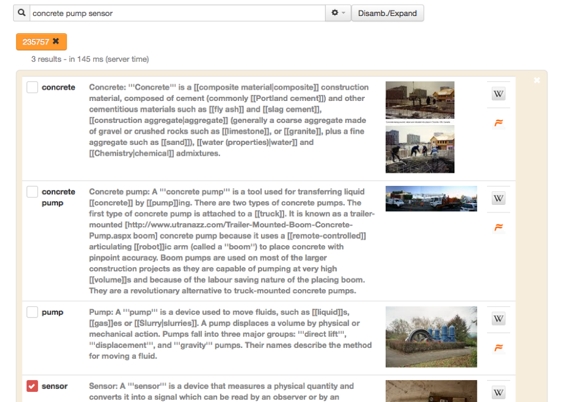
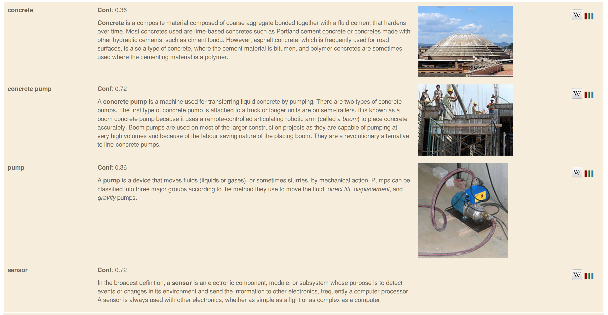
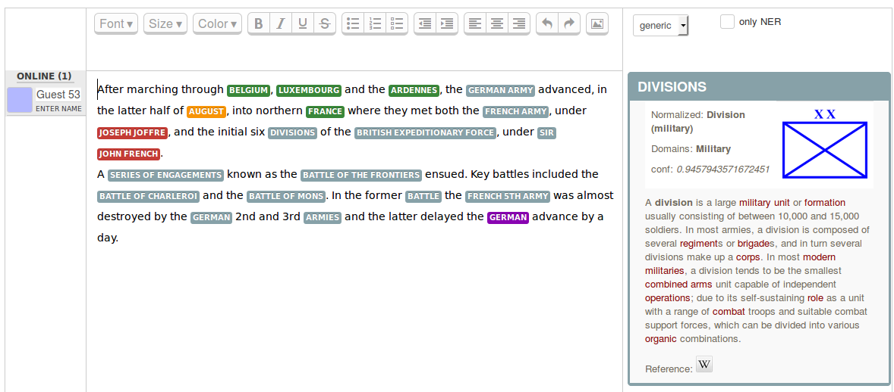
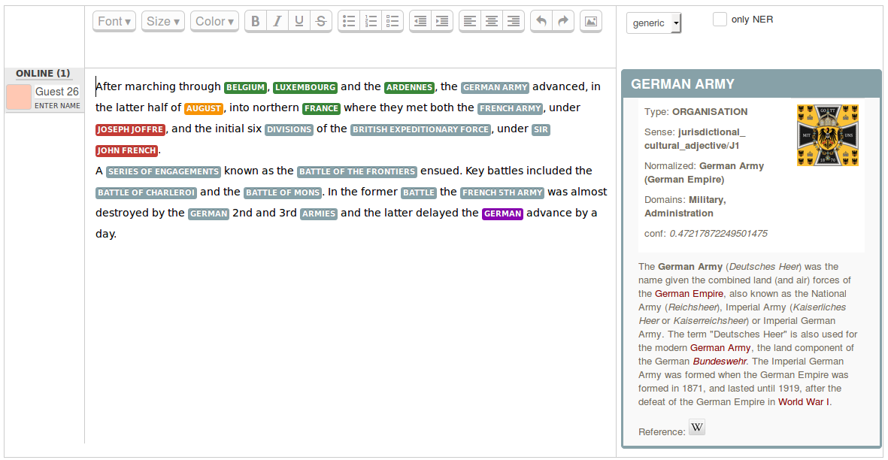

.. topic:: Overview of *entity-fishing*

Overview
========

Motivation
**********

One of the backbone of the activities of scientists regarding technical and scientific information at large is the identification and resolution of specialist entities. This could be the identification of scientific terms, of nomenclature-based expressions such as chemical formula, of quantity expressions, etc. It is considered that between 30 to 80% of the content of a technical or scientific document is written in specialist language `(Ahmad, 1996) <http://citeseerx.ist.psu.edu/viewdoc/download?doi=10.1.1.50.7956&rep=rep1&type=pdf>`_. Researchers in Digital Humanities and in Social Sciences are often first of all interested in the identification and resolution of so-called named entities, e.g. person names, places, events, dates, organisation, etc. Entities can be known in advance and present in generalist or specialized knowledge bases. They can also be created based on open nomenclatures and vocabularies and impossible to enumerate in advance.

The *entity-fishing* services try to automate this recognition and disambiguisation task in a generic manner, avoiding as much as possible restrictions of domains, limitations to certain classes of entities or to particular usages. 

Tasks
*****

*entity-fishing* performs the following tasks:

* entity recognition and disambiguation against Wikidata in a raw text, partially-annotated text segment,

* entity recognition and disambiguation against Wikidata at document level, for example a PDF with layout positioning and structure-aware annotations,

* search query disambiguation (the *short text* mode) - below disambiguation of the search query "concrete pump sensor" in the service test console,

* weighted term vector disambiguation (a term being a phrase),

* interactive disambiguation in text editing mode.  

Summary
*******

Supervised machine learning is used for the disambiguation, based on Random Forest and Gradient Tree Boosting exploiting various features, including word and entity embeddings. Training is realized exploiting Wikipedia, which offers for each language a wealth of usage data about entity mentions in context. Results include in particular Wikidata identifiers and, optionally, statements. 

The API also offers the possibility to apply filters based on Wikidata properties and values, allowing to create specialised entity identification and extraction (e.g. extract only taxon entities or only medical entities in a document) relying on the current 37M entities and 154M statements present in Wikidata. 

The tool currently supports English, German, French, Spanish and Italian languages (more to come!). For English and French, a Name Entity Recognition based on CRF `grobid-ner <https://github.com/kermitt2/grobid-ner>`_ is used in combination with the disambiguation. For each recognized entity in one language, it is possible to complement the result with crosslingual information in the other languages. A *nbest* mode is available. Domain information are produced for a large amount of entities in the technical and scientific fields, together with Wikipedia categories and confidence scores.

The tool is developed in Java and has been designed for fast processing (at least for a NERD system, 500-1000 words per second on a medium-profile linux server single thread or one PDF page of a scientific articles in 1-2 seconds), with limited memory (at least for a NERD system, here 3GB of RAM) and to offer relatively close to state-of-the-art accuracy (more to come!). A search query can be disambiguated in 1-10 milliseconds. *entity-fishing* uses the very fast `SMILE ML <https://haifengl.github.io/smile/>`_ library for machine learning and a `JNI integration of LMDB <https://github.com/deephacks/lmdbjni>`_ as embedded database. 

How to cite
***********

License and contact
*******************

Distributed under `Apache 2.0 license <http://www.apache.org/licenses/LICENSE-2.0>`_. The dependencies used in the project are either themselves also distributed under Apache 2.0 license or distributed under a compatible license. 

Main author and contact: Patrice Lopez (<patrice.lopez@science-miner.com>)

*entity-fishing* is developed by `SCIENCE-MINER <http://science-miner.com/entity-disambiguation/>`_ since 2015, with contributions of `Inria <https://inria.fr>`_ Paris (2017-2018). 

Inria contributors were supported by the H2020 `HIRMEOS <http://www.hirmeos.eu>`_, `IPERION-CH <http://www.iperionch.eu>`_ and `DESIR <https://www.dariah.eu/activities/projects-and-affiliations/desir/>`_ EU projects. 

.. 
